# Pi 系统演进历史

## 这一节解决什么问题

如果只看当前目录，Pi 很容易被误读为“一个终端编码代理，加上一组逐渐增多的包”。Git 历史呈现的是另一条路线：仓库最初的 `pi` 是 GPU Pod 与 vLLM 部署工具，编码代理只是配套能力；随后多模型、浏览器界面、长期会话、可编程嵌入和进程恢复等压力，连续推动了模型层、代理运行时、产品层、资源生态与持久化服务边界的重划。

这一节不按提交数量罗列功能，而回答三个问题：

1. 每个阶段的 Pi **是什么**，当时的核心边界在哪里。
2. 为什么上一阶段的设计不再够用，哪一种真实需求推动了下一次抽象。
3. 历史设计今天留下了哪些结构、兼容层和迁移成本。

### 证据范围

- 产品基线固定为 `origin/main` 的 `587be985a`，历史范围是 2025-08-09 至 2026-08-25，共 5802 个可见提交。
- 文中的具体提交日期采用 Git 作者日期；阶段边界以 commit hash 为准，避免作者日期与提交者日期因迁移或合并不同而产生歧义。
- 根提交 `a74c5da11` 已经是 v0.5.0、63 个文件和 14,558 行新增内容。因此本文把它称为“Git 可见的初始快照”，不把它误写成项目真正的第一天。
- 2025-12 与 2026-01 分别有 872 和 1224 个提交。`AgentSession`、会话树和扩展系统集中形成于这段高强度演进期。
- 本地仓库没有可用标签；版本节点以 `Release v...` 提交、各包 `CHANGELOG.md` 和历史 `package.json` 为证据。
- 当前检出的中文注释分支及未提交修改不作为产品演进证据；历史内容全部通过 `git show <commit>:<path>`、提交差异和 `origin/main` 核对。

## 演进路线总览

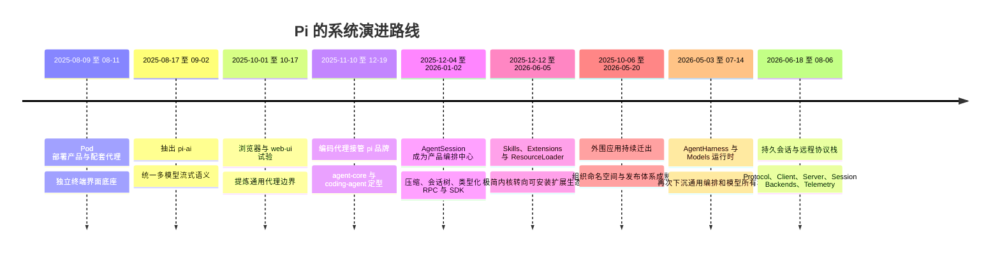

| 阶段 | 时间 / commit 范围 | 核心变化 | 解决的问题 | 演进原因 |
|------|-------------------|----------|------------|----------|
| 1. Pod 产品与配套代理 | `a74c5da11` - `386f90fc3` | `pi` 管理 GPU Pod；`pi-agent` 提供工具调用、会话和终端界面 | 远端部署模型后需要直接验证代理能力 | 先把部署、代理和终端界面放进同一锁步版本仓库，快速形成可用闭环 |
| 2. 统一模型层 | `f064ea0e1` - `66cefb236` | 抽出 `pi-ai`，统一 Anthropic、OpenAI、Gemini 的消息与流 | 单一 OpenAI SDK 抽象无法表达各供应方差异 | 多供应方、思考内容、工具调用和流事件需要稳定的领域协议 |
| 3. 通用运行时与产品层拆分 | `b67c10dfb` - `ffc9be886` | 浏览器和 `web-ui` 试验后，重建 `agent`，新增 `coding-agent` | 旧代理混合了模型、工具、渲染和存储，难以复用于不同界面 | 浏览器端的状态、附件、持久化和传输需求暴露了正确的可复用边界 |
| 4. 编码代理成为 Pi | `92bad8619` - `4fb3af93f` | 删除旧代理；`coding-agent` 获得 `pi` 命令；通用包命名为 `pi-agent-core` | 仓库同时存在两个产品身份和多个命令入口 | 编码代理形成更清晰的用户价值，原 Pod 产品退为旁支 |
| 5. 长期会话运行时 | `79731249e` - `d0a4c3702` | `AgentSession`、压缩、会话树、类型化 RPC、SDK、鉴权与模型注册 | 长任务不能只靠线性消息数组和界面内状态 | 会话需要可暂停、分支、压缩、程序化控制并被其他应用复用 |
| 6. 可安装扩展生态 | `09bca9672` - `89a92207f` | Skills、Extensions、Pi Packages、`ResourceLoader`、项目信任 | 极简默认能力与不同用户工作流之间存在张力 | 把计划、子代理、权限和自定义工具变成外部扩展，而不是固化进内核 |
| 7. 仓库收窄与工程化 | `aa005d062` - `b141e1fa2` | 浏览器扩展、代理、Mom、Pods、`web-ui` 迁出；切换组织命名空间并强化发布 | 单仓同时维护实验应用和核心运行时，边界与发布成本持续扩大 | 保留可复用底座和官方编码代理，把垂直应用放到独立仓库 |
| 8. 第二次运行时抽取 | `a5b27367d` - `9993c9690` | `AgentHarness` 下沉会话树、压缩和执行环境；`Models` 接管供应方与鉴权 | `AgentSession` 与全局模型注册已经承担过多产品职责 | 嵌入式、远程和多实例使用要求实例级依赖、无副作用入口及可替换存储 |
| 9. 持久化与远程化 | `7ece19b0e` - `6fb2d766a` | 引入服务端、SQLite、线协议、客户端、会话后端和遥测 | 进程内 JSONL 会话不能保证崩溃恢复、单写者和跨进程控制 | 接受的操作需要持久边界，界面需要权威快照，传输与运行时需要解耦 |

---

## 阶段拆解

### 阶段一：`pi` 是 GPU Pod 产品，代理是配套验证工具

**这一阶段是什么**：Git 可见的初始 Pi 是一个锁步版本的 TypeScript monorepo。`@mariozechner/pi` 位于 `packages/pods`，安装 `pi` 命令并管理 GPU Pod、vLLM 与模型进程；`@mariozechner/pi-agent` 是通用工具调用代理；`pi-tui` 是独立终端界面库。

**为什么需要它**：部署一个面向工具调用的自托管模型后，需要马上验证它是否能进行代码导航、执行命令和连续对话。把 Pod 管理、代理和终端界面放进同一仓库，可以形成“部署模型—获得 OpenAI 兼容端点—用代理验证”的完整闭环。

**历史证据**：

- `a74c5da11`（2025-08-09）一次性加入 `agent`、`pods`、`tui` 三个包。根 `README.md` 明确把仓库描述为管理大模型部署和构建代理的工具集合。
- 同一提交的 `packages/pods/package.json` 将 `@mariozechner/pi` 映射到 `pi` 命令，描述为管理 GPU Pod 上 vLLM 部署的命令行工具；`packages/agent/package.json` 只映射 `pi-agent`。
- 初始 `packages/agent/README.md` 已提供文件读取、目录枚举、Shell、Glob、Ripgrep、JSON 输出和自动会话保存；它不是空壳原型。
- `afa807b20`（2025-08-10）增加终端抽象、虚拟终端和差分渲染测试；`386f90fc3`（2025-08-11）继续将渲染收窄为行级更新；`6e40c5d76` 修复内容超过视口后的乱码。

**当时的系统形态**：

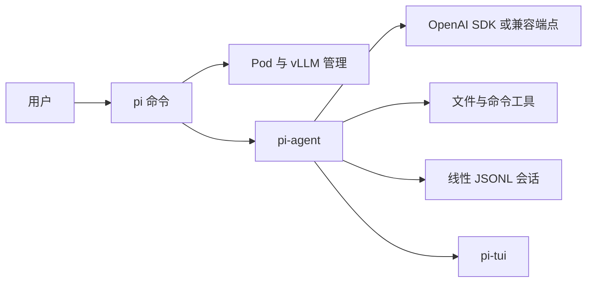

根 `README.md` 当时写出的依赖顺序是 `pi-tui → pi-agent → pi`。代理直接依赖 OpenAI SDK，并把代理循环、编码工具、渲染方式和会话管理放在一个包中。

**暴露的问题**：初始文档声称可连接多种 OpenAI 兼容端点，但“兼容端点”只能覆盖 HTTP 形状相似的部分。Anthropic、Gemini、OpenAI Responses 的思考内容、流事件、工具参数、缓存与用量语义并不相同。代理层如果直接吸收这些差异，后续每个界面和产品都会重复处理。

**引入的变化**：这一阶段最重要的技术选择不是某个代理功能，而是提前把 `pi-tui` 独立出来，并用终端抽象和虚拟终端测试固定渲染契约。它为后来重写编码代理界面留下了可复用底座。

**为什么这样演进**：

- **明确事实**：初始 Pod 文档把内置代理描述为测试代理型模型的工具；包依赖也显示 Pod 产品依赖代理。
- **合理推断**：代理最初很可能由模型部署产品的验证需求驱动，而不是先有一个独立编码代理商业定位。仓库没有更早历史，不能确认作者最初构思顺序。

**留下的影响**：今天 `pi-tui` 仍是独立包，差分渲染仍是其核心身份；所有包从第一天就采用锁步版本，也解释了当前每次发布为何会同时触及多个包。与此相反，最初占据 `pi` 名称的 Pod 产品已经不在仓库中。

---

### 阶段二：抽出 `pi-ai`，让模型差异停止污染代理

**这一阶段是什么**：`pi-ai` 成为独立的多供应方模型访问层，开始统一消息内容块、工具、用量、终止原因和流式事件，而代理只消费统一语义。

**为什么需要它**：代理循环需要的是“模型产生文本、思考或工具调用”这一稳定协议，而不是某家 SDK 的原始事件。只有把供应方差异放到代理之外，同一个代理、终端界面和未来的浏览器界面才能真正切换模型。

**历史证据**：

- `f064ea0e1`（2025-08-17）创建 `packages/ai`，提交中同时放入统一接口计划和 Anthropic、Gemini、OpenAI API 调研资料。
- `e5aedfed2` 实现 Anthropic 与公共 `types.ts`；`8364ecde4` 增加 OpenAI Completions 和 Responses；`a8ba19f0b` 增加带流式输出和工具支持的 Gemini。
- `004de3c9d`（2025-09-02）以 `AsyncIterable` 引入新的流式生成接口，并新增跨供应方的 `generate.ts` 与事件类型。
- `66cefb236` 在同日进行大规模 API 重构，表明早期接口仍在围绕统一语义快速收敛。

**当时的系统形态**：

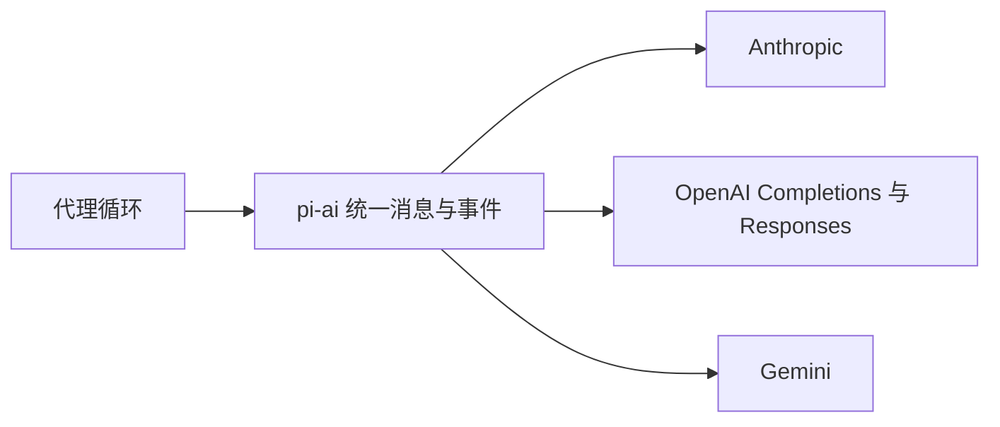

**暴露的问题**：最初的 `pi-agent` 仍然把通用代理状态、工具、会话和界面放在一起；即使模型层统一了，这个代理也无法轻易放进浏览器或由服务端代理请求。换句话说，模型差异被隔离后，应用运行环境的差异成为下一层主要矛盾。

**引入的变化**：`pi-ai` 将供应方模型变成统一 `Model`、内容块和事件流；模型目录、价格、上下文窗口与思考能力也逐渐成为该层数据，而不再散落在命令行选项中。

**为什么这样演进**：

- **明确事实**：提交标题、公共类型和逐个供应方实现直接证明目标是统一多供应方 API。
- **合理推断**：从“OpenAI 兼容即可”转向独立供应方实现，说明协议差异已经超过兼容端点能够可靠隐藏的范围。提交没有给出一次性的故障事件，因此这是由变更顺序支持的设计推断。

**留下的影响**：当前所有代理生成最终仍通过 `pi-ai`；`packages/ai/src/api`、`providers`、`models.ts` 和模型目录都是这一决策的延伸。后续 `Models` 重构改变了实例所有权，但没有推翻“模型领域与代理领域分开”的边界。

---

### 阶段三：浏览器和 `web-ui` 试验逼出通用代理边界

**这一阶段是什么**：仓库用浏览器阅读助手和 `pi-web-ui` 探索第二种运行环境，并从其中反向提炼新的通用 `agent` 包和专用 `coding-agent` 包。

**为什么需要它**：终端代理可以直接访问文件系统、进程和本地凭证；浏览器却需要附件、IndexedDB、跨域代理、可观察状态以及直接或服务端两种传输方式。旧代理把这些关注点混在一起，无法跨界面复用。

**历史证据**：

- `b67c10dfb`（2025-10-01）新增跨浏览器阅读助手；后续提交处理浏览器内容安全策略、文档附件、模型选择和沙箱产物。
- `f2eecb78d`（2025-10-05）新增 `pi-web-ui`，一次性加入界面组件、附件、模型选择、`DirectTransport`、`ProxyTransport` 与浏览器会话状态。
- `e5cf25a26`（2025-10-06）重构 Web 代理并加入 IndexedDB 会话后端和仓储层。
- `ffc9be886`（2025-10-17）将旧代理移动到 `agent-old`，重建 `packages/agent`，并新增只有 `read`、`bash`、`edit`、`write` 四个基础工具的 `packages/coding-agent`。
- 同一提交的 `docs/agent.md` 明确写出：旧代理紧耦合 OpenAI SDK，混合代理逻辑、工具和渲染；新的通用包以 Web 代理为参考设计，编码工具和 JSONL 会话留在专用产品包。这是直接设计证据，不是事后猜测。

**当时的系统形态**：

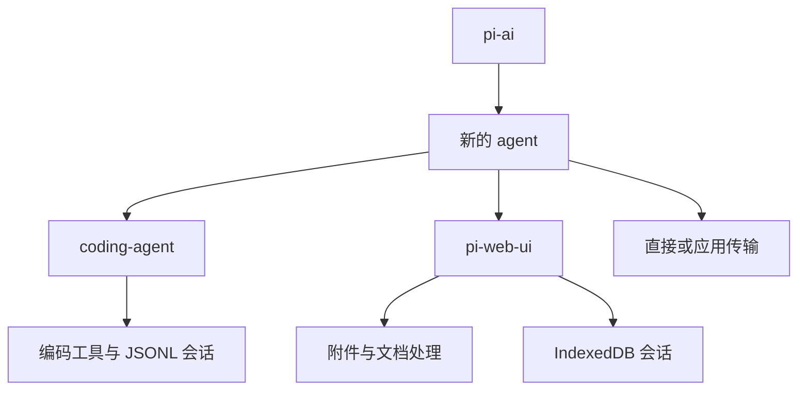

**暴露的问题**：Web 试验中形成的 `Transport` 抽象解决了浏览器直连和服务端代理问题，但也把代理核心与具体传输模型绑定。到 2025-12，代理核心再次移除这些传输类，改为直接接收流函数，说明传输是应用边界，不应成为代理领域本身。

**引入的变化**：

- 通用代理负责状态、消息转换、事件、队列、取消和工具循环。
- 编码代理负责文件工具、会话、命令行和终端交互。
- Web 层保留附件解析、浏览器存储和展示组件。
- 旧实现暂存为 `agent-old`，先以新包验证，再删除旧包。

**为什么这样演进**：

- **明确事实**：`docs/agent.md` 明确要求从 `pi-web-ui` 提取基础设施，使用“提取而非重写”的迁移策略，并列出旧包的耦合问题。
- **合理推断**：浏览器产品本身生命周期很短，但它最持久的产出是正确的包边界；它充当了架构试验场，而不是仓库最终主产品。

**留下的影响**：今天仍能看到稳定的 `pi-ai → pi-agent-core → pi-coding-agent` 分层。`agent-old` 与最初的 Web `Transport` 已消失，但“通用循环不拥有产品工具和界面”成为后续所有重构的基础约束。

---

### 阶段四：编码代理接管 `pi` 名称，产品身份完成转移

**这一阶段是什么**：新 `coding-agent` 从试验包成为仓库的官方用户产品；通用代理则明确退到 `pi-agent-core`。原来属于 Pod 产品的 `pi` 命令和品牌逐步转交给编码代理。

**为什么需要它**：拆包之后仍存在旧代理、新编码代理、Pod 产品和多个命令入口。用户需要一个明确的主产品，维护者也需要区分可复用运行时与具有产品策略的终端应用。

**历史证据**：

- `92bad8619`（2025-11-10）删除 `agent-old`，共移除 4143 行，表明新边界已经替代旧实现。
- `97c730c87` 同日增加新的极简 TUI 实现，重新围绕编码代理构建交互层。
- `bf1a7d857`（2025-11-12）给 coding-agent 增加 `pi` 命令别名；`68092ccf0` 增加 `text`、`json`、`rpc` 三种运行模式。
- `79ee33c3f` 将产品包命名为 `@mariozechner/pi-coding-agent`；`e1856daf5`（2025-11-21）将通用包命名为 `pi-agent-core`。
- `227aedc6d` 把 README 开场重写为“极简、有明确主张、多模型、可在会话中切换模型并支持无界面任务”的编码代理价值说明。
- `4fb3af93f`（2025-12-19）把 Pods 的命令改名为 `pi-pods` 以避免和 `pi` 冲突，完成命令层面的品牌让位。

**当时的系统形态**：

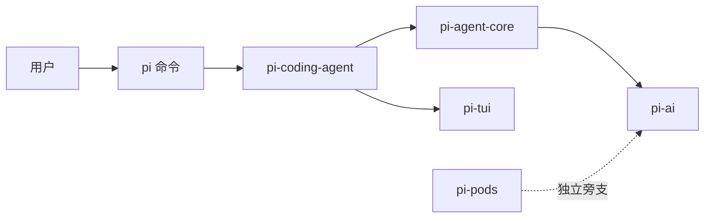

**暴露的问题**：编码代理拥有命令、模式和产品策略后，会话管理成为新的复杂度中心。线性 JSONL 加少量命令能保存聊天，却不能可靠表达压缩点、历史分支、嵌入式控制和运行中消息队列。

**引入的变化**：产品层承担默认工具、命令行、交互界面和用户体验；`agent-core` 只承担消息、工具和循环。`text/json/rpc` 模式还首次把“人类交互”和“程序控制”作为同一产品的并列入口。

**为什么这样演进**：

- **明确事实**：命令别名、包重命名、README 价值说明和 Pods 命令改名形成连续证据链。
- **合理推断**：仓库没有一条名为“品牌迁移”的总提交，但这些变更共同证明 `pi` 的产品身份由部署工具转向编码代理，而不只是新增了一个别名。

**留下的影响**：当前用户安装的是 `@earendil-works/pi-coding-agent`，但底层仍以 `pi-agent-core` 和 `pi-ai` 形式单独发布。Pi 因而既是一个有明确默认策略的产品，又是一组可嵌入库。

---

### 阶段五：`AgentSession` 把聊天进程升级为长期会话运行时

**这一阶段是什么**：`AgentSession` 成为编码代理的产品编排中心，统一代理循环、持久化、压缩、模型与思考级别、队列、Shell 执行、会话切换和各运行模式。

**为什么需要它**：长期编码任务会超出上下文窗口，需要在不中断会话历史的前提下压缩模型上下文；用户还需要回到旧节点、建立分支、从程序控制完整会话，并让 Slack 等其他产品复用相同行为。

**历史证据**：

- `79731249e`（2025-12-04）加入手动和自动压缩、RPC 压缩命令以及保留压缩记录的分支逻辑。
- 2025-12-09 的一组连续工作包依次建立 `AgentSession`：`29d96ab25` 建立骨架，`eba196f4a` 接入事件和持久化，`d08e1e53e` 增加提示、队列、取消和重置，`0119d7610` 管理模型、思考级别和队列模式，`8d6d2dd72` 接入压缩，`94ff0b096` 接入 Shell，`934c2bc5d` 接入会话管理，`e9f6de7cb` 和 `0020de851` 将新命令行与交互模式迁入。
- `3559a43ba` 同日重写类型化 RPC，使用关联编号暴露模型、思考、压缩、Shell、会话、分支与导出能力，并增加 `RpcClient`。
- `3f6db8e99`（2025-12-11）将 Slack 机器人 Mom 改为使用 `AgentSession` 管理上下文，证明它开始成为可复用产品运行时，而不只是 TUI 内部控制器。
- `5482bf3e1`（2025-12-22）新增 `createAgentSession()` SDK 工厂；`54018b6cc` 将凭证与模型发现集中到 `AuthStorage` 和 `ModelRegistry`。
- `c58d5f20a`（2025-12-25）把会话从线性序列升级为带 `id/parentId` 的树并提供 v1 到 v2 迁移；`4958271dd`（2025-12-29）增加 `/tree` 导航、分支摘要和对应钩子。
- `a055fd448`（2025-12-28）开始把 `agent-loop` 从 `pi-ai` 移到 `agent` 并删除早期 `Transport` 抽象；该提交明确标记为当时尚不能编译的阶段性提交，同日后续清理、文档与修复提交继续完成迁移。`d0a4c3702`（2026-01-02）再将队列语义拆为打断当前运行的 `steer()` 与等待当前运行结束的 `followUp()`。

**当时的系统形态**：

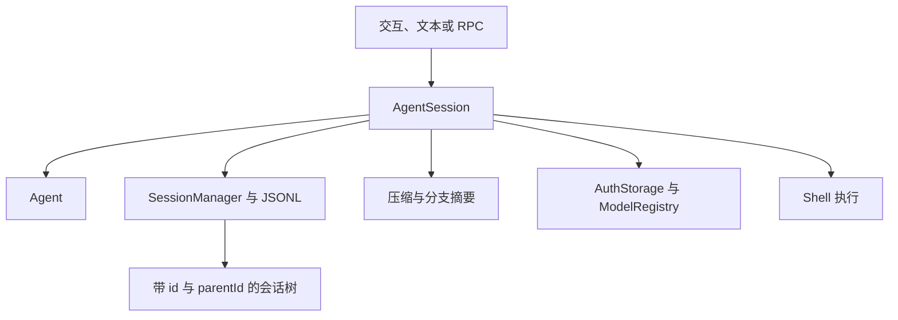

会话文件同时承担完整审计历史和恢复状态；发送给模型的上下文则沿当前叶子回溯，并在最近压缩点处接入摘要。压缩减少模型上下文，不删除原始 JSONL 历史。

**暴露的问题**：`AgentSession` 成功统一了产品行为，也由此逐渐变成“所有产品功能都经过的中心”。资源发现、扩展、鉴权、模型、存储和界面都围绕它增长。它适合单进程命令行，却缺少崩溃恢复所需的操作日志、单写者租约和可替换持久化协议。

**引入的变化**：

- 会话从消息数组升级为树形持久状态。
- 压缩与分支成为一等会话记录，而不是界面临时行为。
- 类型化 RPC 与 SDK 让相同运行时可被进程外和进程内调用。
- 通用代理循环正式归属 `agent-core`，传输由调用方提供流函数。

**为什么这样演进**：

- **明确事实**：连续工作包名称和提交说明直接描述了保留旧代码、逐项接入 `AgentSession` 的迁移过程；Mom 的迁移与 SDK 进一步证明复用目标。
- **合理推断**：`AgentSession` 的集中不是一次“上帝对象”设计，而是把先前散落在命令行、TUI 和管理器中的既有行为收拢后形成的历史结果。

**留下的影响**：截至研究基线，普通 `pi` 主路径仍由 `packages/coding-agent/src/core/agent-session.ts` 与 `session-manager.ts` 驱动，本地 JSONL RPC 也仍位于 `packages/coding-agent/src/modes/rpc`。它们是成熟生产路径；后来的 `AgentHarness` 尚未完全取代它们。

---

### 阶段六：极简产品理念转化为 Skills、Extensions 与 Packages

**这一阶段是什么**：Pi 没有把计划模式、子代理、待办和权限确认全部做成核心功能，而是建立一套可发现、可重载、可安装的资源与扩展系统，让不同用户在核心之外组合工作流。

**为什么需要它**：产品已经有四个基础工具和成熟会话，但真实用户需要不同的提示词、领域说明、工具、主题、安全策略和自动化。全部内置会扩大上下文、固定工作流并持续增加核心耦合；完全不支持又会限制使用场景。

**历史证据**：

- `09bca9672`（2025-12-12）加入 `SKILL.md` 体系，同时兼容 Claude Code 与 Codex 的技能目录。
- `3424550d2`（2025-12-17）在 README 中正式写明不内置 MCP、子代理、权限弹窗、计划模式、待办和后台 Shell；同一文档指向命令行工具、tmux、自定义工具和钩子作为替代路线。
- `2846c7d19`（2026-01-04）新增尚未接线的统一 Extensions 骨架；`c6fc08453`（2026-01-05）正式把 hooks 与 custom tools 合并为 `ExtensionAPI`，把文件命令重命名为提示模板，并将会话版本升级到 v3 以迁移自定义消息。
- `c6fc08453` 同时保留并迁移计划模式、子代理、待办、权限门禁、受保护路径等示例，证明“不内置”不等于“不支持”。
- `b846a4bfc`（2026-01-20）引入 `ResourceLoader`、`PackageManager`、npm/Git 包源、`pi install/remove/update` 和 `/reload`，把零散目录发现升级为安装和加载协议。
- `89a92207f`（2026-06-05）增加项目信任门禁：未信任项目的本地可执行资源和设置不会在启动时自动生效。

**当时的系统形态**：

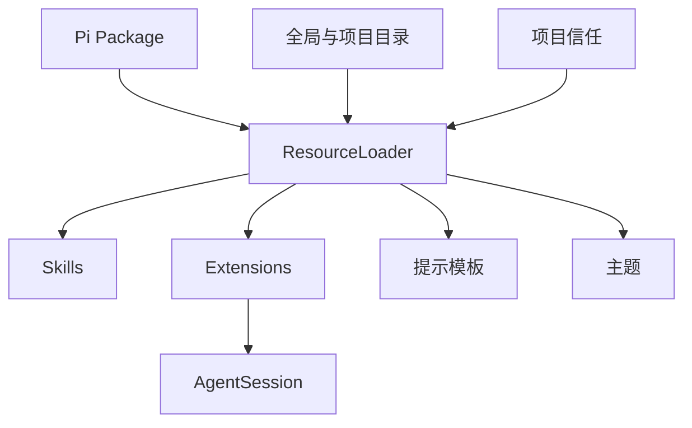

**暴露的问题**：扩展代码与项目配置具有与 Pi 进程相同的权限。项目信任只能控制是否自动加载项目本地资源，不能隔离工具执行、网络、凭证或文件系统。仓库后来明确把强隔离交给容器或操作系统沙箱。

**引入的变化**：

- Skills 提供按需读取的领域说明。
- Extensions 统一事件钩子、工具、命令和终端界面扩展。
- Pi Packages 将资源组合成可安装单元。
- `ResourceLoader` 成为 SDK 与命令行共享的资源边界。
- 项目信任只解决“是否加载仓库内可执行配置”，没有伪装成完整权限系统。

**为什么这样演进**：

- **明确事实**：历史 README 明确说明这些缺省是为减少上下文膨胀和避免反模式；扩展示例直接给出被外置能力的实现。
- **合理推断**：Pi 的“极简”不是功能数量最少，而是核心只规定通用机制，不规定用户工作流。这一解释同时符合文档和扩展代码的增长方式。

**留下的影响**：当前 `AgentSession` 仍通过 `ResourceLoader` 获得扩展、技能、提示模板和主题；计划、子代理与权限门禁仍可以扩展形式实现。产品的默认行为保持收窄，但扩展加载、优先级、重载、兼容和信任成为新的复杂度来源。

---

### 阶段七：外围应用迁出，仓库从产品集合收窄为 Harness 项目

**这一阶段是什么**：仓库持续移除或迁出浏览器扩展、代理服务、Dosbox、Slack 机器人、Pod 管理和 `web-ui`，同时从个人命名空间迁到组织命名空间，并加强依赖与发布治理。

**为什么需要它**：这些应用验证了通用能力，但每个应用都有独立发布周期、界面技术和产品方向。继续放在锁步版本 monorepo 中，会让核心运行时的发布承担无关应用成本，也模糊“Pi 到底是什么”。

**历史证据**：

- `aa005d062`（2025-10-06）删除浏览器扩展的 3122 行，将其迁往独立的 Sitegeist 仓库。
- `0f98decf6`（2025-12-28）移除 proxy，说明代理能力已由 `web-ui` 的流函数和外部服务承担。
- `866d21c25`（2026-01-22）将 `pi-dosbox` 迁往独立仓库。
- `0ed0d4343`（2026-04-30）删除 Mom 与 Pods，共移除 12,964 行，并把 Slack/聊天用户导向独立 `pi-chat`。
- `3e5ad67e0`（2026-05-07）把包命名空间从 `@mariozechner` 迁到 `@earendil-works`。
- `b141e1fa2`（2026-05-20）删除 `web-ui` 工作区，共移除约 18,564 行。此后成熟核心只剩 `agent`、`ai`、`coding-agent`、`tui`。
- 同日的 `2e02c74dc` 固定直接依赖并采用原生 TypeScript 工作流，`715c82ce0` 为 coding-agent 生成发布依赖收缩文件；`f3b4e1285`（2026-05-29）推进可信发布，`7d4c0e05d`（2026-08-22）在编码代理发行物中捆绑 Node 运行时。

**当时的系统形态**：外围应用从主仓消失，但它们推动形成的模型层、代理核心、资源系统和 SDK 留下。仓库中心由“多个 Pi 产品”变为“一个官方编码代理，加上可复用运行时”。

**暴露的问题**：收窄仓库没有消除嵌入和远程使用需求。相反，当 Mom、`pi-chat` 和其他应用不再与核心同仓时，稳定的运行时、存储和远程协议边界变得更重要，不能继续依赖同进程内部实现细节。

**引入的变化**：

- 垂直产品采用独立仓库，核心通过已发布包供它们使用。
- 组织命名空间替代个人命名空间。
- 依赖锁定、发布依赖收缩文件、可信发布和独立发行物把安装链路当作产品边界治理。

**为什么这样演进**：

- **明确事实**：各删除提交都说明了迁出目标或替代项目；命名空间和发布提交直接可核对。
- **合理推断**：这不是简单清理死代码，而是架构与组织边界同步收敛：主仓负责通用运行时和官方编码代理，其他界面成为消费者。

**留下的影响**：当前根 README 将项目定义为 “Pi Agent Harness”，只突出 `pi-ai`、`pi-agent-core`、`pi-coding-agent`、`pi-tui` 和 `pi-telemetry` 等核心包；远程相关包虽然仍在仓库中，但被明确标注为实验性能力。

---

### 阶段八：`AgentHarness` 与 `Models` 进行第二次运行时抽取

**这一阶段是什么**：系统开始把 `AgentSession` 中可跨产品复用的会话树、压缩、执行环境和编排能力下沉到 `pi-agent-core` 的 `AgentHarness`；同时把模型目录、供应方、鉴权和 OAuth 生命周期下沉到 `pi-ai` 的实例级 `Models` 运行时。

**为什么需要它**：第一次拆分解决了“代理核心不拥有产品工具和界面”；但成熟后的 `AgentSession` 又拥有会话、压缩、资源、存储、模型和鉴权。嵌入式与多实例应用需要注入自己的文件系统、存储和供应方集合，不能依赖编码代理的全局注册表和 Node 环境。

**历史证据**：

- `a5b27367d`（2026-05-03）在 `pi-agent-core` 一次性新增 3678 行 Harness 基础，包括 `AgentHarness`、压缩、执行环境、消息、提示模板、会话树和截断工具。
- `b7ea82105`（2026-05-14）让 Harness 直接运行代理循环，`80c918c24`（2026-05-15）隔离 Node 文件系统会话依赖，显示其目标是运行环境可替换。
- `f63095cff`（2026-06-10）新增 `Models`、`MutableModels`、`createModels`、供应方映射与供应方自有鉴权；同日的 `ba93da9a9` 将 API 实现移入 `src/api` 并加懒加载包装。
- `fec0c3d12` 增加按供应方拆分的模型目录与 `createProvider()`；`4d5c01582` 将 OAuth 流程接入新的 `OAuthAuth`；`8a0903ebf` 建立无副作用根入口与 `/compat` 兼容入口。
- `129eb460c`（2026-06-23）完成模型运行时迁移。`pi-agent-core` v0.80.0 的 changelog 同时要求 `AgentHarnessOptions.models`，说明 Harness 的所有生成、压缩和分支摘要统一通过注入的 `Models` 实例执行。
- `9993c9690`（2026-07-14）让 coding-agent 使用 `ModelRuntime` 组合内置目录、`models.json` 和扩展覆盖，只把 `ModelRegistry` 保留为扩展兼容外观。

**当时的系统形态**：

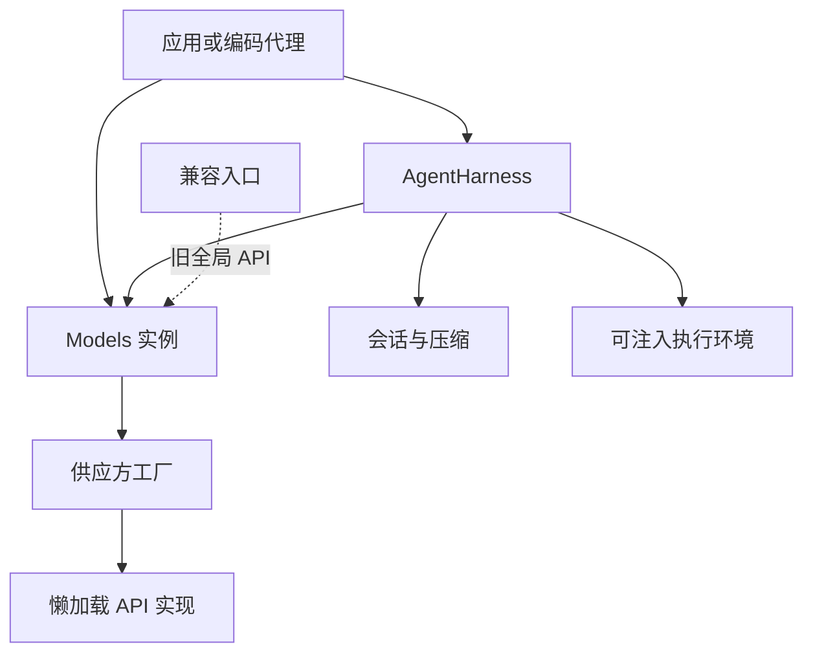

**暴露的问题**：初版 Harness 仍沿用了现有会话树和 JSONL 思维，能够封装会话行为，但尚不能保证进程崩溃后的运行恢复、并发单写者和远程客户端状态一致性。`Models` 解决了模型实例所有权，却没有解决操作持久性。

**引入的变化**：

- Harness 成为 `Agent` 之上的第二层编排抽象：`Agent` 管一次内存中的工具循环，Harness 管会话、上下文、压缩和执行环境。
- `Models` 把供应方目录、流函数和鉴权绑定到实例，减少全局可变注册与导入副作用。
- `/compat` 明确保存旧 API，允许扩展在迁移期继续工作。

**为什么这样演进**：

- **明确事实**：提交差异显示代码从 coding-agent 的既有能力下沉；模型重构提交说明直接把供应方自有鉴权、懒加载和无副作用入口列为目标。
- **合理推断**：这是第一次包拆分后的“第二次抽取”。第一次分开模型、通用循环和产品；第二次继续分开产品会话编排、持久状态和模型实例所有权。

**留下的影响**：当前存在两层真实运行时：成熟命令行仍以 `AgentSession` 为中心，`pi-agent-core` 同时提供新的 `AgentHarness`。`packages/ai/src/compat.ts` 与 coding-agent 的 `ModelRegistry` 外观则是模型迁移留下的兼容接缝。

---

### 阶段九：持久会话与远程协议栈建立，但迁移尚未完成

**这一阶段是什么**：Pi 开始把会话从“某个进程写入的 JSONL 聊天树”升级为可恢复、可查询、受单写者约束的持久状态，并建立运行时无关的二进制协议、客户端和可组合服务端。

**为什么需要它**：只要会话只能在一个命令行进程中运行，`AgentSession` 足以管理状态；一旦客户端会断线、进程会崩溃、多个界面会连接同一会话，接受提示、执行工具和移动分支都必须有明确的持久接受边界和权威快照。

**历史证据**：

- `7ece19b0e` 与 `0d02df760`（2026-06-18）建立 `orchestrator` 包和 supervisor；`8495f9d0d`（2026-07-21）将其重命名为 `server`，把概念从本地进程编排收敛到会话服务。
- `9e7582aa0`（2026-07-21）新增 SQLite 会话存储、迁移、会话条目、顺序、分支和物化统计结构；`37eb243d2` 为 `AgentHarness` 对齐执行工具。
- `c820aa26f`（2026-07-28）合并 durable Harness 设计。文档明确列出持久运行、正确分支语义、单写者、恢复、权威快照与可观测性目标，并区分会话条目和操作编排条目。
- `56eb685b6`（2026-07-30）增加长度前缀加 CBOR 的远程会话协议；`33bc0a7b8`（2026-07-31）增加运行时无关客户端；`2e60d3cbd` 同日增加由应用注入 `PiServerService` 的可组合服务端。
- `1d0c97471`（2026-08-04）实现基于内存存储的 Harness v2 与后端一致性测试；`05bf9df65` 删除旧服务端实现，避免两条服务端架构继续并行。
- `a80008b96`（2026-08-05）将 `storage` 重命名为 `session-backends`；`6b461b75b` 抽出供应商无关遥测包；同日前后加入 JSONL v4、恢复查询和 lane/operation 记录。
- v0.84.0 的 `packages/agent/CHANGELOG.md` 明确宣布以 lane 型 `Session`、`SessionStorage`、`SessionRepo` 和持久操作记录替换旧 Harness 会话模型，同时也明确说明 `AgentHarness` v2 仍是“可完整编译的骨架”，未完成路径抛出 `HarnessNotImplemented`。
- `6fb2d766a`（2026-08-06）在 coding-agent 中加入可配置 Harness 工厂和 JSONL 会话桥接，表明产品层已经能构造新运行时，但不等于默认 `AgentSession` 已被替换。

**当时的系统形态**：

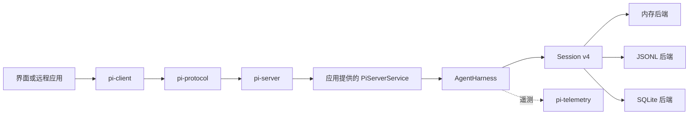

新持久模型的关键变化不是把 JSONL 换成数据库，而是把“会话内容”和“Harness 做过什么”分开记录：

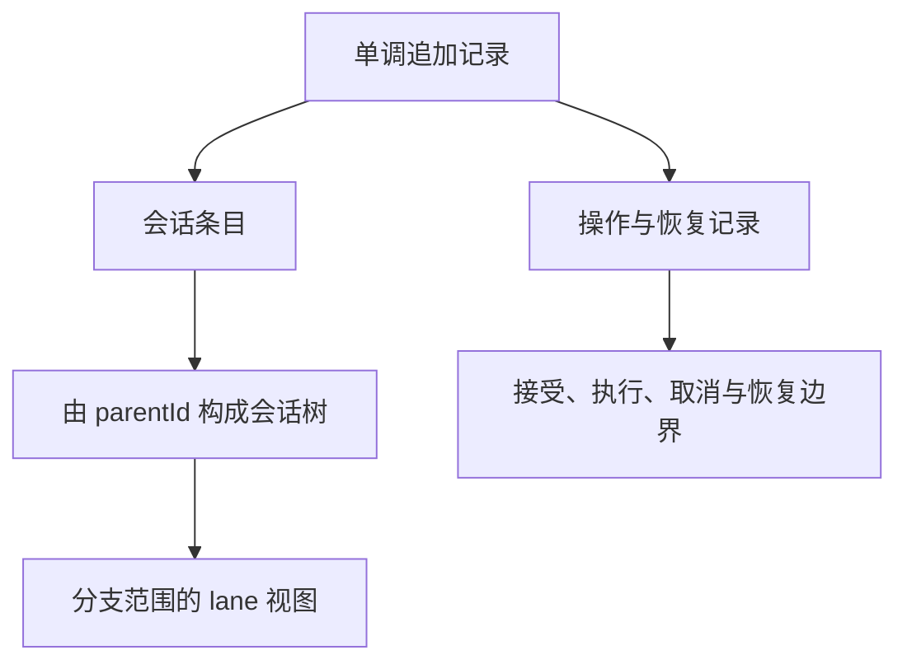

**暴露的问题**：截至 `587be985a`，`packages/agent/src/harness/agent-harness.ts` 仍定义并使用 `HarnessNotImplemented`；`pi-server` README 也明确称 API 尚不稳定，且服务端不提供独立 coding-agent 服务。与此同时，普通 `pi` 仍使用成熟的 `AgentSession + JSONL v3` 主路径。

**引入的变化**：

- `SessionRepo` 把存储构造、会话生命周期和查询从 Harness 中分离。
- lane、共享顺序号、操作记录、全局事实和 writer lease 提供恢复与并发基础。
- `pi-protocol` 规定严格校验的长度前缀 CBOR 消息，但不绑定具体传输。
- `pi-client` 维护权威快照、请求关联和会话租约；`pi-server` 只拥有协议与领域对象的适配边界。
- `pi-telemetry` 将 AI 请求与 Harness 生命周期的可观测语义从具体厂商实现中抽离。

**为什么这样演进**：

- **明确事实**：durable Harness 设计文档直接列出崩溃恢复、正确分支、单写者、快照和遥测目标；协议、客户端和服务端 README 明确各自边界。
- **合理推断**：远程栈不是为“给现有 RPC 换编码格式”而建，而是在给持久 Harness 提供进程边界。其 Session 租约、权威快照和恢复记录都超出了旧本地 RPC 的职责。

**留下的影响**：仓库当前同时存在两套会话模型与两类协议：成熟的 `AgentSession/SessionManager` 与本地 JSONL RPC，以及实验性的 `AgentHarness/Session v4` 与 CBOR 远程协议。这是迁移接缝，不应被描述为已经完成的统一架构。

---

## 关键转折点

| 转折点 | 之前的设计 | 之后的设计 | 转向原因 | 当前影响 |
|--------|------------|------------|----------|----------|
| 模型领域独立 | 代理直接依赖 OpenAI SDK 或兼容端点 | `pi-ai` 统一供应方、消息和流事件 | Anthropic、OpenAI、Gemini 的语义无法靠单一兼容接口可靠表达 | 所有模型、鉴权和目录能力都有独立归属 |
| Web 试验反向提炼核心 | 一个包同时拥有代理、工具、渲染和会话 | `pi-agent-core` 与 `pi-coding-agent` 分层 | 浏览器、终端和服务端需要不同界面、存储与传输 | 当前最稳定的包依赖主干由此形成 |
| Pi 品牌转移 | `pi` 是 Pod/vLLM 管理命令 | `pi` 是自扩展编码代理，Pod 改名并最终迁出 | 编码代理形成更清晰、增长更快的产品价值 | 根仓以官方编码代理和 Harness 为中心 |
| 会话成为运行时 | 线性消息与少量继续命令 | `AgentSession`、压缩、树、RPC、SDK | 长任务、上下文上限、分支和嵌入要求统一状态机 | `AgentSession` 至今仍是成熟主路径和主要复杂度中心 |
| 工作流外置 | 持续向核心增加专用功能 | Skills、Extensions、Packages、`ResourceLoader` | 保持默认上下文和策略收窄，同时允许用户定制 | 核心极简，但资源加载、信任和兼容成为长期边界 |
| 从会话树到持久操作日志 | 进程内 JSONL 只记录对话结果 | Session v4 同时记录会话树和编排事实 | 崩溃恢复、远程连接和单写者需要可恢复的接受边界 | 新旧会话和协议栈暂时并存，Harness 尚未完全接管产品主链 |

## 演进思路总结

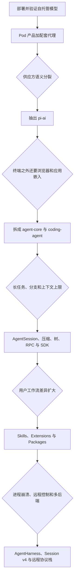

Pi 的演进主线不是单向增加功能，而是反复执行同一种动作：先用一个具体产品把能力做通，再把被多个场景证明通用的部分下沉，最后把不属于核心的产品迁出。`pi-ai` 来自多模型压力，`pi-agent-core` 来自多界面压力，`AgentSession` 来自长期任务压力，扩展生态来自工作流分歧，`AgentHarness + Session v4` 则来自持久化和远程化压力。

因此今天的 Pi 同时具有三种身份：

1. 对终端用户，它是有明确默认工具和产品哲学的编码代理。
2. 对嵌入者，它是 `pi-ai`、`pi-agent-core` 和 SDK 组成的运行时。
3. 对未来服务化场景，它正在形成持久 Session、Client、Protocol、Server 和 Backend 组成的远程 Harness，但这部分仍处于迁移期。

## 事实与推断边界

- **明确事实**：
  - `a74c5da11` 的 `@mariozechner/pi` 与 `pi` 命令属于 `packages/pods`，而非编码代理。
  - `ffc9be886:docs/agent.md` 明确把 Web 代理视为新通用代理的参考实现，并指出旧代理的耦合问题。
  - 2025-12-09 的连续提交明确按工作包把现有行为迁入 `AgentSession`；会话树、RPC、SDK 和资源系统都有独立提交证据。
  - Pods、Mom、浏览器扩展和 `web-ui` 均由删除或迁出提交证实；命名空间迁移也有单独提交。
  - durable Harness 设计明确要求持久运行、单写者、恢复和权威快照；v0.84.0 changelog 明确说明未完成路径仍会抛出 `HarnessNotImplemented`。
  - 基线源码中成熟 `AgentSession` 与实验性 `AgentHarness` 同时存在，本地 JSONL RPC 与远程 CBOR 协议也同时存在。
- **合理推断**：
  - 配套代理最初主要服务于 Pod 部署后的模型验证；该结论由初始 README 和依赖方向支持，但更早动机不可见。
  - 浏览器与 `web-ui` 的长期价值主要是架构试验和边界发现，而不是要成为主仓永久产品；迁出历史和提取文档共同支持这一判断。
  - `AgentHarness` 是对成熟 `AgentSession` 通用职责的第二次抽取，远程协议是其进程边界，而不是旧 RPC 的简单替换。
  - 主仓从个人实验集合转向组织维护的运行时与官方产品，是命名空间迁移、外围包删除和供应链治理共同体现的组织化过程。
- **仍不确定**：
  - 2025-08-09 之前的真实起点、项目名称来源和最早需求不在当前 Git 对象中；不能把 v0.5.0 导入快照称为真正的第一版。
  - 仓库内提交不能完整还原作者、issue 和外部用户对每次转向的影响权重。
  - `AgentHarness/Session v4` 将在何时、通过何种兼容步骤替代 `AgentSession/JSONL v3`，没有可确认的路线图。
  - 本地 JSONL RPC 与远程 CBOR 协议最终会长期并存还是进一步统一，当前历史与源码都没有给出确定答案。
