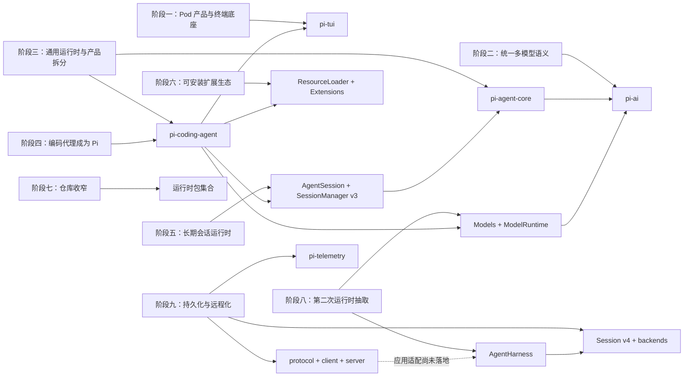
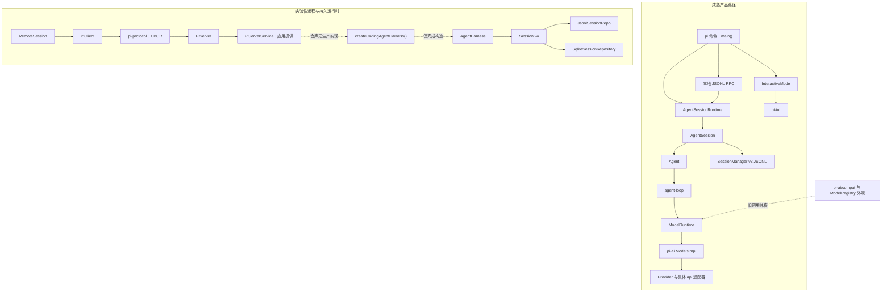
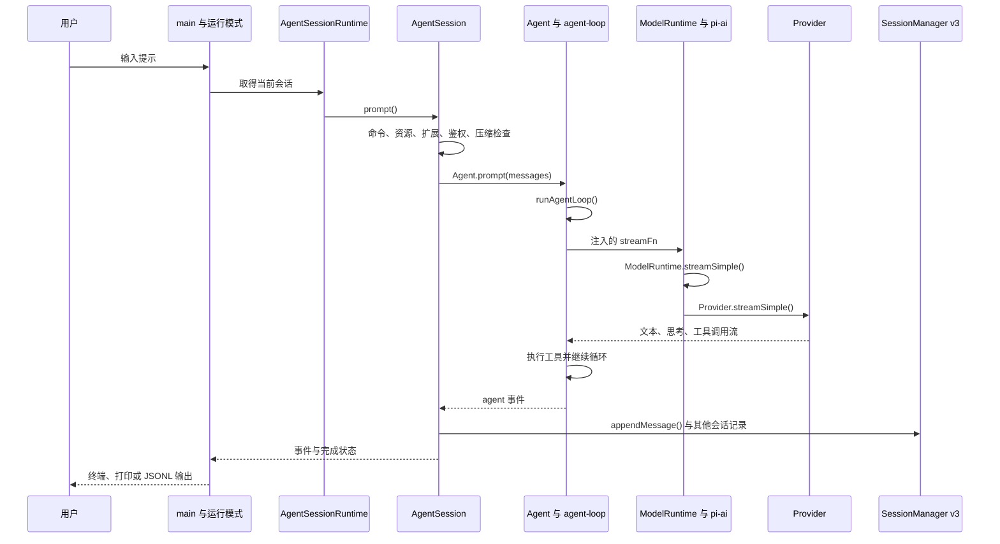
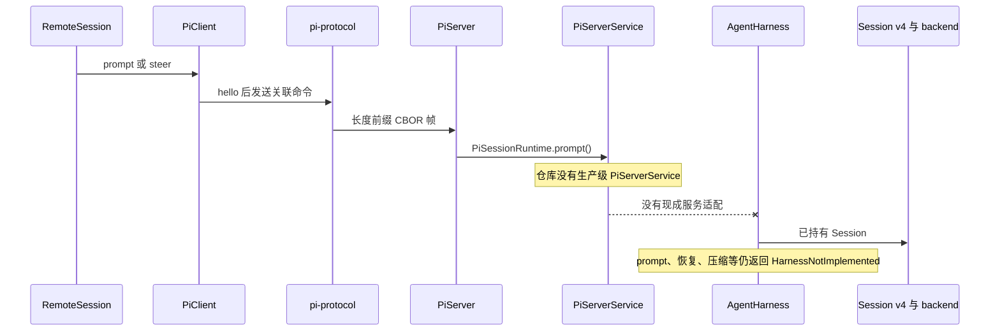
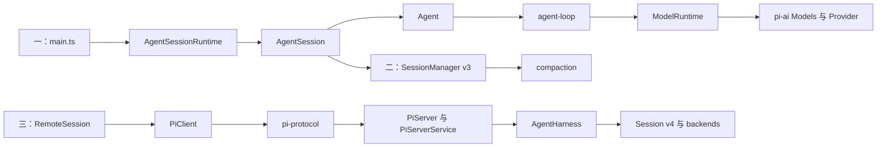

# Pi 当前实现地图

## 这一节解决什么问题

这一节把 [07_evolution_history.md](./07_evolution_history.md) 的九个历史阶段映射到 `origin/main` 的当前代码。它不再回答“某次提交增加了什么”，而回答四个面向当前源码的问题：

1. 历史上形成的能力，今天分别落在哪个包、接口、类型和主调用链里。
2. 当前真正承载 `pi` 命令的成熟路径是什么，哪些代码仍属于实验路径。
3. `AgentSession`、`SessionManager` v3 与 `AgentHarness`、`Session` v4 为什么同时存在。
4. 本地 JSONL RPC 与远程 CBOR 协议解决的是否是同一个问题，能否互相替代。

### 证据边界

- 源码基线固定为 `origin/main` 的 `587be985a093cc74ff24a6e7a8f0f4d84fa1e7b2`。
- 当前工作区存在的中文注释和未提交改动不作为产品证据；本文涉及的产品源码全部从该 Git 对象读取。
- “已经可用”只表示存在完整的当前调用链；只有接口、类型或存储实现，不等于产品路径已经接通。
- 由代码关系推断的未来收敛方向会明确标为“推断”，不把它写成作者已经确认的路线图。

### 先给结论

Pi 当前不是一条从旧运行时完整迁移到新运行时的单线系统，而是两条并存、成熟度不同的链：

- **成熟 CLI 主链**：`AgentSession → Agent → agent-loop → ModelRuntime → pi-ai → Provider`。交互模式、打印模式、本地 RPC、扩展、压缩、会话树和 JSONL 持久化都实际运行在这条链上。
- **实验性远程构件链**：`RemoteSession → PiClient → pi-protocol → PiServer → 应用 PiServerService → AgentHarness → Session v4 → backend`。前四段和存储后端已有实现，但仓库没有生产级 `PiServerService`，`createCodingAgentHarness()` 也没有接入服务端；更关键的是 `AgentHarness.prompt()` 等执行方法仍明确返回 `HarnessNotImplemented`。

因此，当前代码不能简化理解为“v4 已经替换 v3”，也不能把远程 CBOR 协议说成“本地 RPC 的新编码格式”。前者是成熟产品会话与下一代持久运行时脚手架的并存，后者是单进程控制协议与多会话远程服务协议的并存。

---

## 能力到实现的总览

### 历史阶段如何落到当前包

| 历史能力 | 当前实现位置 | 核心抽象 | 运行时入口 | 为什么落在这里 |
|----------|--------------|----------|------------|----------------|
| 终端差分渲染 | `packages/tui/src/`、`packages/coding-agent/src/modes/interactive/` | `TUI`、`TuiMainScreen`、`TuiAltScreen`、`ProcessTerminal` | `InteractiveMode.run()` | 终端绘制与代理语义无关，需要同时服务普通滚屏和全屏视口 |
| 多供应方统一语义 | `packages/ai/src/types.ts`、`models.ts`、`providers/`、`api/` | `Model`、`Context`、`Message`、`Provider`、`Models` | `ModelRuntime.streamSimple()` | 供应方差异应被隔离在模型边界，代理循环只消费统一事件 |
| 通用工具循环 | `packages/agent/src/agent.ts`、`agent-loop.ts` | `Agent`、`AgentState`、`AgentTool` | `Agent.prompt()`、`runAgentLoop()` | 状态推进、模型流和工具调用可被不同产品复用，不应拥有 CLI 与持久化策略 |
| 编码代理产品编排 | `packages/coding-agent/src/main.ts`、`core/agent-session.ts`、`core/agent-session-runtime.ts` | `AgentSession`、`AgentSessionRuntime` | `main()`、`AgentSession.prompt()` | 命令、扩展、重试、压缩、会话和界面属于具体产品策略 |
| 树形会话与压缩 | `packages/coding-agent/src/core/session-manager.ts`、`core/compaction/` | `SessionEntry`、`CompactionEntry`、`SessionManager` | `appendMessage()`、`buildSessionContext()`、`AgentSession.compact()` | 成熟 CLI 需要保留完整历史，同时为模型构建受上下文窗口约束的当前分支 |
| 扩展与资源生态 | `packages/coding-agent/src/core/resource-loader.ts`、`extensions/`、`project-trust.ts` | `ResourceLoader`、`DefaultResourceLoader`、`ExtensionRunner` | `reload()`、`resolveProjectTrusted()` | 极简默认工具与多样工作流之间的差异，交给受信任的外部资源解决 |
| 实例级模型所有权 | `packages/coding-agent/src/core/model-runtime.ts`、`packages/ai/src/models.ts` | `ModelRuntime`、`ModelsImpl`、`MutableModels` | `createAgentSessionServices()`、`createModels()` | 多实例和嵌入式调用不能依赖进程级全局模型注册 |
| 本地程序控制 | `packages/coding-agent/src/modes/rpc/` | `RpcCommand`、`RpcResponse`、`RpcClient` | `runRpcMode()` | 本地调用方需要控制与 CLI 相同的完整 `AgentSessionRuntime`，并复用其行为 |
| 远程多会话控制 | `packages/protocol/`、`client/`、`server/`、`coding-agent/src/client/remote-session.ts` | `Command`、`SessionSnapshot`、`PiClient`、`PiServerService` | `RemoteSession.submit()`、`LiveSessionManager.executeCommand()` | 跨进程、多连接场景需要版本握手、权威快照、传输中立接口和服务所有权边界 |
| 可恢复持久会话 | `packages/agent/src/harness/session/`、`packages/session-backends/sqlite-node/` | `Session`、`SessionRepo`、`SessionStorage`、操作记录 | `JsonlSessionRepo`、`SqliteSessionRepository` | 崩溃恢复、分支、单写者和可审计操作需要比消息 JSONL 更细的持久化协议 |
| 可观测边界 | `packages/telemetry/`、`packages/agent/src/harness/telemetry/` | `TelemetryContext`、跨度结构 | 由运行时注入 | 遥测不能成为模型或代理核心的全局副作用，应通过中立接口承载 |

### 当前依赖与成熟度边界

图中的虚线是当前代码的真实断点，不是绘图省略：远程服务需要应用实现 `PiServerService`，而仓库只提供测试实现；编码代理的 `createCodingAgentHarness()` 没有被服务端生产路径调用；`AgentHarness` 也尚不能执行提示、工具循环、压缩和恢复。

---

## 当前实现分层

### 第一层：产品入口与运行模式

**它是什么**：`@earendil-works/pi-coding-agent` 是当前 `pi` 用户产品。它把同一个会话运行时暴露为交互终端、打印输出、本地 RPC 和 SDK 四类入口。

**为什么需要**：交互用户、Shell 脚本、本地父进程和嵌入式应用需要不同输入输出形态，但不应得到四套不同的模型选择、扩展、压缩和会话语义。

**它承接了哪段历史演进**：阶段四确立编码代理的产品身份；阶段五把模式分派和会话行为集中到 `AgentSession`；阶段七迁出外围应用后，这一包成为官方主产品。

**当前实现**：

- `packages/coding-agent/src/main.ts` 的 `main()` 解析参数、选择或创建会话、处理项目信任，随后建立 `AgentSessionServices` 与 `AgentSessionRuntime`。
- `main()` 根据模式分派到 `InteractiveMode.run()`、`runPrintMode()` 或 `runRpcMode()`。
- `packages/coding-agent/src/core/agent-session-runtime.ts` 的 `AgentSessionRuntime` 持有当前 `AgentSession` 及其工作目录绑定服务；切换、新建、分支或导入会话时重建对应运行时。
- `packages/coding-agent/src/core/sdk.ts` 的 `createAgentSession()` 是嵌入式入口，构造同一种 `Agent` 与 `AgentSession`，不是另一套代理实现。

**为什么边界这样划分**：工作目录会改变项目设置、资源、信任判断、模型配置和工具上下文，因此会话切换不能只替换消息数组。`AgentSessionRuntime` 把“当前会话”和“当前目录的服务集合”作为一个替换单元，避免旧扩展上下文继续操作新会话。

### 第二层：产品会话编排

**它是什么**：`AgentSession` 是成熟 CLI 的行为中心。它不是底层代理循环，而是把用户输入变成一次完整产品操作的协调器。

**为什么需要**：一次 `prompt()` 在 Pi 中不仅是调用模型，还包括命令与模板展开、扩展拦截、鉴权、自动压缩、队列行为、重试、事件广播、会话持久化和界面更新。这些规则属于编码代理产品，不能塞进通用 `Agent`。

**它承接了哪段历史演进**：阶段五的长期会话运行时与阶段六的扩展生态都集中到这里；这也是阶段八再次尝试抽取 `AgentHarness` 的直接背景。

**当前实现**：

- `packages/coding-agent/src/core/agent-session.ts` 的 `AgentSession.prompt()` 先处理扩展命令、输入钩子、Skills 与提示模板，再检查模型鉴权和自动压缩。
- `_runAgentPrompt()` 调用 `this.agent.prompt()`，并处理重试、压缩重启、`steer` 与 `followUp` 队列。
- `_handleAgentEvent()` 把事件先交给扩展和监听器；在 `message_end` 时通过 `SessionManager.appendMessage()` 持久化消息。
- `AgentSession.compact()` 允许 `session_before_compact` 钩子取消或改写压缩，调用底层压缩逻辑后追加 `CompactionEntry`，再重建 `Agent.state.messages`。
- `reload()` 重新加载设置与资源，并使旧扩展上下文失效。

**为什么边界这样划分**：`Agent` 只知道消息、工具和循环；`AgentSession` 才知道“当前会话文件”“扩展命令”“自动压缩阈值”和“Shell 记录”等产品概念。代价是 `AgentSession` 已经成为较大的中心对象，这正是新 `AgentHarness` 试图重新下沉通用能力的原因。

### 第三层：通用代理循环

**它是什么**：`@earendil-works/pi-agent-core` 的成熟部分是一个界面无关、存储无关的状态机，负责把消息送给模型、消费流事件、执行工具并继续循环。

**为什么需要**：终端产品、测试、SDK 或未来服务可以采用不同的存储和界面，但“模型请求—工具调用—工具结果—继续生成”的语义应保持一致。

**它承接了哪段历史演进**：阶段三从浏览器试验中提炼通用边界；阶段五把早期传输抽象移除，令代理直接接收流函数；阶段八又在同一包增加实验性 `AgentHarness`。

**当前实现**：

- `packages/agent/src/agent.ts` 的 `Agent` 持有 `AgentState`、工具、消息转换函数和流函数；`Agent.prompt()` 进入 `runAgentLoop()`。
- `packages/agent/src/agent-loop.ts` 的 `runAgentLoop()` 与内部 `runLoop()` 把 `AgentMessage` 转成模型 `Message`，调用流函数并逐项消费助手事件。
- `streamAssistantResponse()` 产出流式消息事件；停止原因为工具调用时，循环执行工具、追加工具结果，再进入下一轮模型请求。
- `steer` 消息在当前工具轮之后改变下一轮方向；`followUp` 消息在当前运行结束后继续新一轮。

**为什么边界这样划分**：该层不读取会话文件、不解析 CLI、不加载扩展包，也不决定供应方鉴权方式。这样一来，代理循环可测试且可复用；产品层仍可通过注入的消息转换和流函数改变上下文与模型调用。

### 第四层：模型运行时与供应方适配

**它是什么**：`pi-ai` 定义模型领域协议，`ModelRuntime` 则是编码代理对该协议的实例级组合层。两者共同完成从产品模型配置到具体供应方请求的转换。

**为什么需要**：统一的 `Message` 和流事件只能隔离网络协议差异；编码代理还要组合本地凭证、自定义模型、远程模型目录、扩展注册的供应方、运行时登录状态和请求级选项。领域协议与产品配置必须分开。

**它承接了哪段历史演进**：阶段二形成 `pi-ai`；阶段五的 `AuthStorage` 和 `ModelRegistry` 先集中模型发现；阶段八以 `Models` 与 `ModelRuntime` 消除大部分全局注册和副作用。

**当前实现**：

- `packages/ai/src/types.ts` 定义 `Model`、`Context`、`Message`、内容块、工具调用、用量、终止原因和流事件。
- `packages/ai/src/models.ts` 定义 `Provider`、`Models`、`MutableModels`、`ModelsImpl`、`createModels()` 与 `createProvider()`。
- `ModelsImpl.streamSimple()` 根据 `model.provider` 与 `model.api` 找到 `Provider`，再调用其 `streamSimple()`。
- `packages/ai/src/providers/anthropic.ts` 的 `anthropicProvider()` 展示典型组合：鉴权、模型目录和惰性载入的具体接口适配器共同构成 `Provider`。
- `packages/coding-agent/src/core/model-runtime.ts` 的 `ModelRuntime implements Models` 组合 `RuntimeCredentials`、`AuthStorage`、模型配置、内建及扩展供应方，并在 `streamSimple()` 中准备请求后交给选定 `Provider`。
- `packages/coding-agent/src/core/agent-session-services.ts` 的 `createAgentSessionServices()` 为当前工作目录创建 `ModelRuntime`；`createAgentSession()` 把 `modelRuntime.streamSimple()` 包装为 `Agent` 的流函数。

**为什么边界这样划分**：`pi-ai` 保持无产品设置副作用，便于独立嵌入；`ModelRuntime` 承担 Pi 特有的配置和凭证生命周期。`packages/ai/src/compat.ts` 与编码代理的 `ModelRegistry` 外观仍保留旧入口，说明迁移尚未完全删除兼容成本。

### 第五层：资源、扩展与项目信任

**它是什么**：`ResourceLoader` 把 Extensions、Skills、提示模板、主题、上下文文件和包解析成一次会话可用的资源集合；扩展运行时再把注册的工具、命令、钩子、渲染器和供应方接入 `AgentSession`。

**为什么需要**：Pi 有意只内置 `read`、`bash`、`edit`、`write` 四个基础工具。计划模式、子代理、额外工具和团队规则的差异如果都进入核心，产品会不断膨胀；如果不做信任判断，项目目录中的可执行扩展又会成为隐式代码执行入口。

**它承接了哪段历史演进**：阶段六从 Skills、Extensions 发展到 Pi Packages、统一 `ResourceLoader` 和项目信任。

**当前实现**：

- `packages/coding-agent/src/core/resource-loader.ts` 定义 `ResourceLoader`，`DefaultResourceLoader.reload()` 依次处理信任前扩展、设置重载、包与资源解析、扩展载入、Skills、提示、主题和上下文。
- `packages/coding-agent/src/core/project-trust.ts` 的 `resolveProjectTrusted()` 决定是否加载和执行项目局部资源。
- `packages/coding-agent/src/core/extensions/loader.ts` 建立扩展运行环境和注册表；`extensions/runner.ts` 的 `ExtensionRunner` 执行钩子与命令。
- `createAgentSessionServices()` 在资源重载后把扩展注册的供应方合入 `ModelRuntime`。

**为什么边界这样划分**：资源发现与行为执行分离后，包管理可以决定“有哪些资源”，扩展运行时决定“如何调用它们”，`AgentSession` 只在正确生命周期点触发。项目信任只约束项目局部资源加载，不应被误写成工具执行沙箱。

### 第六层：终端输入输出

**它是什么**：`pi-tui` 提供终端组件、输入处理和差分绘制；编码代理在其上维护普通滚屏与全屏两套屏幕策略。

**为什么需要**：普通模式要保留 Shell 原生滚屏历史，全屏模式要拥有可滚动视口、布局、鼠标和文本选择。这两种终端语义互相冲突，不能只靠一个布尔参数隐藏成完全相同的渲染过程。

**它承接了哪段历史演进**：阶段一就独立出的 TUI 底座一直保留；阶段四围绕新编码代理重建交互界面，后续形成两套屏幕所有权策略。

**当前实现**：

- `packages/tui/src/tui-main-screen.ts` 的 `TuiMainScreen` 以 `regular` 模式绘制主界面并保留终端滚屏。
- `packages/tui/src/tui-alt-screen.ts` 的 `TuiAltScreen` 以 `fullscreen` 模式管理备用屏幕、视口、布局、鼠标和选择。
- `interactive-mode.ts` 的 `InteractiveMode` 根据设置选择或切换屏幕，两者都消费同一个 `AgentSession` 事件源。
- `packages/tui/src/terminal.ts` 的 `ProcessTerminal` 处理原始输入、Kitty 键盘协议、输入法硬件光标与转义序列缓冲。

**为什么边界这样划分**：终端协议和布局不应进入 `AgentSession`；反过来，两套界面也不应复制代理状态。共享事件源、分离屏幕所有权，是保留 Shell 行为与获得应用式全屏体验之间的必要折中。

### 第七层：成熟会话 v3 与 JSONL 存储

**它是什么**：`SessionManager` v3 是当前 CLI 的权威持久状态。它用追加式 JSONL 保存一棵由 `id` 与 `parentId` 连接的会话树，并从当前叶子构造发给模型的上下文。

**为什么需要**：完整历史、当前分支与模型上下文不是同一个概念。用户要保留原始消息和分支，模型却只能接收当前路径，并可能从最近的压缩摘要继续。

**它承接了哪段历史演进**：阶段五从线性 JSONL 演进到树形会话、压缩与分支摘要；这是已经经过长期产品使用的路径。

**当前实现**：

- `packages/coding-agent/src/core/session-manager.ts` 定义 `CURRENT_SESSION_VERSION = 3`。
- `SessionEntry` 联合包含消息、思考级别变更、模型变更、压缩、分支摘要、自定义数据、标签和会话信息等记录。
- `SessionManager.appendMessage()` 与其他追加方法通过内部 `_appendEntry()` 写入新节点并推进当前叶子；`branch()` 只移动叶子，不删除旧历史。
- `buildContextEntries()` 沿当前叶子回溯，在最近 `CompactionEntry` 的 `firstKeptEntryId` 处接入摘要和保留项；`buildSessionContext()` 再把记录转换为模型消息。
- 默认会话位于 `~/.pi/agent/sessions/<编码后的工作目录>/`；v1 到 v2 增加树标识，v2 到 v3 把旧 `hookMessage` 迁移为 `custom`。

**为什么边界这样划分**：`SessionManager` 负责“会话事实与模型上下文映射”，`AgentSession` 负责“何时追加、压缩或切换”。这种分工保持了当前产品行为，但文件格式仍以消息和产品事件为中心，不具备执行中操作恢复、租约与多进程一致性。

### 第八层：本地 JSONL RPC

**它是什么**：本地 RPC 是 `pi --mode rpc` 的进程控制接口。父进程启动一个 Pi 子进程，通过标准输入逐行发送 JSON 命令，并从标准输出逐行接收响应和事件。

**为什么需要**：编辑器、脚本或其他本地程序需要复用完整 CLI 会话行为，而不是重新实现模型选择、扩展、会话树和压缩。

**它承接了哪段历史演进**：阶段四建立多运行模式，阶段五将 RPC 类型化并接入 `AgentSession`。

**当前实现**：

- `packages/coding-agent/src/modes/rpc/rpc-types.ts` 定义 `RpcCommand`、响应、代理事件和扩展界面交互类型。
- 命令覆盖提示、`steer`、`follow_up`、取消、新会话、模型、思考级别、队列、压缩、重试、Shell、会话切换与分支、树、导出和消息查询。
- `rpc-mode.ts` 的 `runRpcMode(runtimeHost)` 直接操作与 CLI 相同的 `AgentSessionRuntime`。
- `jsonl.ts` 采用以换行符分隔的 JSON 帧；没有协议版本握手，也不是带 `jsonrpc` 字段的 JSON-RPC 2.0。
- `rpc-client.ts` 的 `RpcClient` 启动 `dist/cli.js --mode rpc` 子进程并关联请求响应。

**为什么边界这样划分**：它假定调用方和 Pi 在同一台机器上，并把子进程本身当成会话隔离边界。协议可以暴露大量产品命令，因为双方使用同一版本程序；它不承担远程认证、多连接附着或跨版本协商。

### 第九层：实验性远程协议、客户端与服务端

**它是什么**：`pi-protocol`、`pi-client` 与 `pi-server` 是面向远程多会话服务的传输和服务边界；`RemoteSession` 是编码代理侧把远程快照转换为可消费会话状态的薄包装。

**为什么需要**：远程界面不能把增量文本当作唯一事实，也不能假定一个进程只有一个当前会话。它需要版本握手、严格验证、请求关联、会话附着、权威快照和应用提供的持久运行时。

**它承接了哪段历史演进**：阶段九的协议、客户端、可组合服务端和持久化拆包。

**当前实现**：

- `packages/protocol/src/schemas.ts` 定义 `SessionSnapshot`、`ServerSnapshot`、命令联合、握手、请求响应和事件信封；所有对象通过运行时模式验证并拒绝未知属性。
- `codec.ts` 与 `framing.ts` 使用四字节无符号大端长度前缀，再承载一个确定长度的严格 CBOR 项。
- 客户端第一帧必须是带 `PROTOCOL_VERSION` 的 `hello`；快照是权威状态，`TranscriptProgress` 只是临时显示提示。
- `packages/client/src/client.ts` 的 `PiClient` 与 `connection.ts` 通过 `ByteTransport` 管理握手、请求关联和快照；`SessionLease`、`SessionHandle` 管理会话附着与操作。
- `packages/coding-agent/src/client/remote-session.ts` 的 `RemoteSession.submit()` 在空闲时调用远端 `prompt`，运行中改为 `steer`，并用快照与进度协调本地转录视图。
- `packages/server/src/server.ts` 的 `PiServer` 处理连接、握手和编码；`sessions.ts` 的 `LiveSessionManager.executeCommand()` 把协议命令转给 `PiSessionRuntime` 并广播新快照。
- `packages/server/src/types.ts` 的 `PiServerService` 是应用边界，要求应用实现 `listSessions()`、`listModels()`、`createSession()` 与 `openSession()`。

**为什么边界这样划分**：`PiServer` 不知道会话存在哪里，也不拥有模型和工具；应用服务负责把协议命令映射到真实运行时。当前仓库除 `packages/server/src/testing/service.ts` 外没有 `PiServerService` 实现，服务端说明也明确标记为实验性、没有独立 CLI。因此这是一组可组合构件，不是当前 `pi` 命令已启用的远程模式。

### 第十层：Session v4、持久后端与 AgentHarness

**它是什么**：`Session` v4 是面向可恢复执行的持久会话协议；`AgentHarness` 是计划在该协议上承载通用代理编排的公开外形；JSONL v4 与 SQLite 是两种后端实现。

**为什么需要**：v3 记录完成后的消息和产品事件，无法精确回答崩溃前某个模型请求、工具调用或队列操作是否已被接受、开始或完成。远程服务还需要单写者所有权、稳定序列和可替换后端。

**它承接了哪段历史演进**：阶段八开始第二次运行时抽取；阶段九增加可恢复记录、后端拆包、租约与遥测边界。

**当前实现**：

- `packages/agent/src/harness/session/types.ts` 定义 `SessionStorage` 与 `SessionRepo`。记录拥有全局递增 `seq`，树节点由 `id` 与 `parentId` 连接，`lane` 指针把多个工作分支与同一记录序列分开。
- 记录类型覆盖操作开始、步骤尝试、工具开始、队列入列与取消、取消请求、延迟写入、用量和操作结束，目标是允许恢复与重放。
- `session/session.ts` 的 `Session` 校验可序列化数据，并把树、记录、事实、统计和 lane 操作委托给 `SessionStorage`。
- `session/memory.ts` 的 `InMemorySessionRepo` 用于内存实现；`session/jsonl/repo.ts` 的 `JsonlSessionRepo` 使用 v4 追加变更日志、同实例写入串行化、原子分支复制和尾部破损修复。
- `packages/session-backends/sqlite-node/src/sqlite/repo.ts` 的 `SqliteSessionRepository` 使用 WAL、同步级别 `FULL`、串行操作队列，以及带期限与围栏值的写者租约。
- `packages/coding-agent/src/server/create-harness.ts` 的 `createCodingAgentHarness()` 能把编码代理的四个工具和系统提示组合为 `AgentHarness`，但该文件没有从编码代理公开入口导出，也没有实现 `PiServerService`。

**当前未实现部分**：

- `AgentHarness.create()` 检测到非空存储时直接抛出 `HarnessNotImplemented("create.restore")`。
- `hooks` 与 `events` 使用不可用注册表。
- `prompt()`、`skill()`、`promptFromTemplate()`、`compact()`、`navigateTree()`、`resume()`、`abort()`、`steer()`、`followUp()`、`nextRun()`、队列取消、用量记录、等待、动作执行、观察与 lane 操作均返回 `HarnessNotImplemented`。
- 当前可工作的部分主要是配置读写、模型和思考级别切换、工具与资源集合、叶子查询和关闭。

**为什么边界这样划分**：数据协议和后端可以先独立验证，再接执行运行时；这减少了持久化正确性与代理行为同时变化的风险。但当前状态只能称为“数据模型和后端已落地、执行运行时是脚手架”。把它描述成现有 CLI 的替代品会掩盖最关键的未实现路径。

### 第十一层：遥测接口

**它是什么**：`pi-telemetry` 是供应方中立的跨度与上下文接口，代理包另定义模型请求和 Harness 生命周期的遥测结构。

**为什么需要**：远程和可恢复运行时需要跨模型请求、工具与持久操作关联观测数据，但核心库不能强制绑定某个遥测厂商或建立全局单例。

**它承接了哪段历史演进**：阶段九从 Harness 代码中抽出独立遥测包，使模型层、代理层和应用可以注入同一上下文。

**当前实现**：

- `packages/telemetry/src/` 定义 `TelemetryContext`、跨度结构、无操作实现与内存实现。
- `packages/agent/src/harness/telemetry/` 定义 `pi.ai.request` 与 `pi.harness.*` 等结构。
- 因 `AgentHarness` 执行路径尚未实现，这些 Harness 事件目前更多是稳定的接口边界，而不是成熟产品主链的完整运行证据。

**为什么边界这样划分**：独立包避免 `pi-ai` 和 `pi-agent-core` 依赖具体采集后端，也让本地 CLI 可以选择无操作实现。它为远程链准备了关联能力，但不能据此推断远程执行已经完成。

---

## 核心能力落点

### 成熟 CLI 的一次提示如何运行

链中一个容易误读的兼容细节是：`createAgentSession()` 除了把 `ModelRuntime.streamSimple()` 注入新 `Agent`，还通过 `pi-ai/compat` 的 `setDefaultStreamFn()` 保留旧扩展和低层调用方式。这是兼容入口，不是主链仍依赖全局模型运行时的证据。

### 实验性远程调用目前在哪里断开

这条图不是说协议无法工作：协议、客户端和服务端都有各自完整实现与测试构件。断点在“应用如何获得一个能真正执行的 `PiSessionRuntime`”，以及“`AgentHarness` 如何把持久操作记录推进成模型和工具执行”。

### 八项核心能力的当前路径

| 能力 | 用户入口 | 内部路径 | 状态 / 数据 | 关键失败点 |
|------|----------|----------|-------------|------------|
| 交互提示 | `pi` | `main → InteractiveMode → AgentSessionRuntime → AgentSession.prompt → Agent.prompt → runAgentLoop` | `AgentState` 与 `SessionManager` v3 | 凭证缺失、上下文溢出、工具失败、扩展异常 |
| 非交互提示 | `pi -p` 或 JSON 输出 | `main → runPrintMode → AgentSession.prompt` | 与交互模式共用会话和模型状态 | 输出格式不能替代运行时错误处理 |
| 本地进程控制 | `pi --mode rpc`、`RpcClient` | `runRpcMode → AgentSessionRuntime → AgentSession` | 单进程当前会话；JSONL 命令与事件 | 子进程退出、行帧损坏、命令关联失败 |
| 模型请求 | 会话选择的模型 | `AgentSession → streamFn → ModelRuntime.streamSimple → ModelsImpl/Provider → api` | 凭证、模型目录、请求选项、用量 | 供应方鉴权、模型缺失、重试与速率限制 |
| 工具循环 | 模型产生工具调用 | `agent-loop → AgentTool.execute → toolResult → 下一轮模型请求` | `AgentState.messages`；完成后写 v3 | 参数无效、执行取消、工具结果丢失 |
| 压缩与分支 | 自动阈值、`/compact`、会话树操作 | `AgentSession.compact → compaction → SessionManager.appendCompaction/buildSessionContext` | 完整树、当前叶子、摘要和 `firstKeptEntryId` | 摘要失败、扩展取消、模型上下文重建错误 |
| 扩展重载 | 启动、`/reload`、SDK | `ResourceLoader.reload → ExtensionRunner → AgentSession` | 项目与全局设置、包、资源、信任状态 | 不受信项目资源被跳过、旧上下文失效 |
| 远程多会话 | `RemoteSession` | `PiClient → pi-protocol → PiServer → PiServerService` | 权威 `SessionSnapshot` 与临时进度 | 生产服务缺失；未接可执行 Harness |

### 本地 JSONL RPC 与远程 CBOR 协议对照

| 维度 | 本地 JSONL RPC | 远程 CBOR 协议 |
|------|----------------|-----------------|
| 当前成熟度 | 当前 `pi` 已使用并公开文档化 | `protocol` 与 `server` 明确标记实验性，无兼容保证 |
| 传输 | 子进程标准输入输出 | `ByteTransport`，可由 Unix 套接字或其他传输承载 |
| 帧格式 | 每行一个 JSON 对象，仅接受换行分隔 | 四字节大端长度加一个确定长度 CBOR 项 |
| 握手 | 无版本握手 | 第一条客户端消息必须是含 `PROTOCOL_VERSION` 的 `hello` |
| 验证 | 解析命令并按类型分派 | 运行时模式严格验证，拒绝未知字段、非法 CBOR 和超限帧 |
| 会话模型 | 一个子进程持有一个当前 `AgentSessionRuntime`，可切换其当前会话 | 一个连接可附着多个远程会话，服务端广播权威快照 |
| 命令范围 | 接近完整产品能力：会话树、压缩、Shell、重试、扩展界面交互等 | 较窄：列表、创建、附着、分离、提示、转向、取消、模型、思考级别 |
| 状态同步 | 响应和细粒度代理事件 | `SessionSnapshot` 为权威，`TranscriptProgress` 只用于临时显示 |
| 运行时后端 | 直接操作成熟 `AgentSession` 与 v3 JSONL | 依赖应用提供 `PiServerService` 与 `PiSessionRuntime` |
| 安全边界 | 继承本地子进程权限 | 传输层必须在交换协议字节前完成认证和授权 |
| 二者关系 | 本地产品控制接口 | 远程多会话服务协议；不是前者的二进制升级版 |

---

## 历史包袱与当前约束

| 当前复杂点 | 来源阶段 | 为什么还保留 | 如果重做可以怎样简化 |
|------------|----------|--------------|------------------------|
| `AgentSession` 同时协调扩展、模型、队列、压缩、存储和模式事件 | 阶段五、六 | 它承载当前 CLI 的完整稳定行为，直接拆除会影响大量入口和扩展契约 | 先让新运行时达到行为等价，再按能力迁移；不能只换类名和存储格式 |
| `SessionManager` v3 与 `Session` v4 并存 | 阶段五、八、九 | v3 驱动产品；v4 有更强数据协议与后端，但 Harness 执行未完成 | 完成执行、恢复和服务适配后设计显式迁移；当前不能假装已有自动替换 |
| 本地 JSONL RPC 与远程 CBOR 协议并存 | 阶段五、九 | 二者分别优化同版本本地子进程与跨传输多会话服务 | 若未来远程链成熟，可共享命令语义；仍应保留不同传输和状态模型 |
| `pi-ai/compat` 与 `ModelRegistry` 外观 | 阶段五到八 | 旧扩展和低层流调用仍依赖全局式入口 | 先统计并迁移外部调用者，再删除兼容层；不能从当前主链已实例化就推断兼容层无用 |
| `createCodingAgentHarness()` 存在但没有生产服务接线 | 阶段八、九 | 工具与系统提示桥接可独立验证，服务契约和执行运行时仍在演进 | 增加应用级 `PiServerService` 适配前，先实现 Harness 的提示、恢复和快照语义 |
| `AgentHarness` 公开外形大于实际能力 | 阶段八、九 | 类型和存储契约先稳定，可让后端并行开发 | 对调用者显式标记能力状态；逐条实现并以恢复测试证明，不用静默降级到旧会话 |
| 普通屏幕与全屏两套 TUI | 阶段一、四及后续终端演进 | Shell 滚屏与应用视口所有权是不同终端语义 | 可以共享更多组件和事件转换，但不能强行合并屏幕生命周期 |
| 所有包锁步版本 | 阶段一至今 | 历史上产品与底层包共同发布，减少兼容矩阵 | 独立版本可减少无关发布，但会引入包间兼容管理；这不是运行时层面的首要问题 |
| 旧 Pod、浏览器和 `web-ui` 已迁出，但其抽象仍留在核心边界 | 阶段一、三、七 | TUI、模型统一、通用 Agent 与资源分层正是这些试验留下的有效成果 | 不应因产品已迁出而删除已被当前主链证明有效的边界 |

### 当前最重要的约束判断

1. **成熟主链仍以 `AgentSession` 为准**：任何修改当前 `pi` 行为的工作，应先追踪 `AgentSession`，而不是从 `AgentHarness` 开始。
2. **v4 的“已实现”主要在数据协议和后端**：`JsonlSessionRepo` 与 SQLite 后端不是空壳，但它们尚未组成可替代 CLI 的端到端运行时。
3. **远程服务端是框架，不是应用**：`PiServer` 负责协议和连接；真实模型、工具、会话创建与恢复必须由 `PiServerService` 提供。
4. **本地与远程协议不应机械统一**：共享领域命令可能有价值，但本地事件流和远程权威快照服务于不同一致性模型。
5. **兼容层删除需要外部证据**：`compat.ts` 的存在说明包外调用者仍在迁移范围内，不能仅凭仓库内主链判断可删。

---

## 继续改代码的入口

| 修改目标 | 先读哪里 | 需要理解的历史原因 | 风险 |
|----------|----------|--------------------|------|
| 改 `pi` 启动与模式分派 | `packages/coding-agent/src/main.ts`、`core/agent-session-runtime.ts` | 多模式共享同一会话行为，工作目录与资源生命周期绑定 | 只改一个模式会造成行为分叉；替换会话后旧扩展上下文必须失效 |
| 改提示、队列、重试或扩展时序 | `core/agent-session.ts`、`core/extensions/runner.ts` | `AgentSession` 是产品编排层，不是单纯模型包装 | 事件持久化顺序、`steer` 与 `followUp` 语义容易回归 |
| 改工具循环 | `packages/agent/src/agent.ts`、`agent-loop.ts` | 通用循环刻意不拥有 CLI、扩展和存储 | 不要把产品设置下沉；必须保持工具结果和后续模型轮的顺序 |
| 增加或修改供应方 | `packages/ai/src/models.ts`、`providers/`、`api/`、`coding-agent/src/core/model-runtime.ts` | `pi-ai` 统一领域语义，`ModelRuntime` 组合产品凭证与配置 | 供应方流事件、工具参数、用量和终止原因映射必须完整 |
| 改会话文件或上下文构建 | `coding-agent/src/core/session-manager.ts`、`core/compaction/` | v3 同时保存完整树和派生模型上下文，并有旧版本迁移 | 不能删除历史节点；压缩摘要和 `firstKeptEntryId` 必须保持可重建 |
| 改扩展、Skills 或包加载 | `core/resource-loader.ts`、`core/extensions/`、`core/project-trust.ts` | 极简核心依赖外部资源扩展，项目资源可执行 | 信任状态、加载顺序、重复注册和旧上下文失效是主要风险 |
| 改终端渲染 | `packages/coding-agent/src/modes/interactive/interactive-mode.ts`、`packages/tui/src/tui-main-screen.ts`、`packages/tui/src/tui-alt-screen.ts` | 普通滚屏与全屏视口有不同所有权 | 需要分别验证尺寸变化、滚动、输入法、鼠标与流式更新 |
| 改本地 RPC | `modes/rpc/rpc-types.ts`、`rpc-mode.ts`、`jsonl.ts`、`rpc-client.ts` | 它暴露成熟 `AgentSessionRuntime` 的广泛能力 | 命令、响应、事件和客户端关联必须同步；不要误套远程协议假设 |
| 改远程协议 | `packages/protocol/src/schemas.ts`、`codec.ts`、`framing.ts` | 严格模式与权威快照是远程一致性基础，协议无兼容保证 | 客户端、服务端和所有传输必须同步；未知字段和限制行为不可遗漏 |
| 实现远程应用服务 | `packages/server/src/types.ts`、`sessions.ts`、`coding-agent/src/server/create-harness.ts` | 服务端故意不拥有产品运行时；当前没有生产 `PiServerService` | 必须先决定会话租约、恢复、快照生成和模型目录所有权 |
| 继续实现 `AgentHarness` | `packages/agent/src/harness/agent-harness.ts`、`session/types.ts`、`compaction/`、`telemetry/` | v4 目标是可恢复执行，不只是复制 `AgentSession` 方法 | 每个操作都涉及持久接受点、崩溃恢复和幂等；不能只让方法不再抛错 |
| 改 v4 JSONL 后端 | `agent/src/harness/session/jsonl/`、`session/testing/conformance.ts` | 后端保存的是变更日志、lane 和操作记录 | 尾部修复、原子分支和同实例串行化必须保持；它不等同于 SQLite 的跨进程租约 |
| 改 SQLite 后端 | `packages/session-backends/sqlite-node/src/sqlite/repo.ts` | 远程多进程场景需要 WAL、写者租约和围栏值 | 租约过期、旧写者和事务顺序会产生一致性错误 |

### 建议的源码阅读顺序

如果目标是理解“Pi 现在为什么长成这样”，最短路径不是按目录从上往下读，而是沿成熟链、状态链、实验链三次穿透：

第一遍建立当前可运行事实，第二遍理解长期会话为什么成为产品中心，第三遍再看作者如何为远程、多实例和崩溃恢复重新切边界。倒过来先读 `AgentHarness`，很容易把清晰的接口外形误认为已经替代成熟产品路径。

---

## 尚未闭合的问题

以下问题在当前源码中没有足够证据给出确定答案：

1. `AgentHarness` 是否最终完整替代 `AgentSession`，还是只为服务端和嵌入式场景提供第二套运行时。当前代码表现出能力重叠，但没有完成迁移，也没有确认路线图。
2. 生产级 `PiServerService` 将放在本仓库、独立应用仓库，还是由每个使用方自行实现。当前 `server` 的设计明确支持第三种可能。
3. 本地 JSONL RPC 是否会长期保留全部产品命令，远程协议是否会扩展到会话树、压缩和 Shell。当前命令集合差异可能是成熟度差异，也可能是有意边界。
4. v3 到 v4 是否会提供文件级迁移。当前 v3 有内部版本迁移，v4 有独立仓储协议，但没有跨体系迁移器。

在这些问题闭合前，最可靠的维护原则是：把 `AgentSession` 主链视为当前产品事实，把 Remote、Server、`AgentHarness` 与 Session v4 视为已经有真实基础设施、但端到端执行尚未完成的实验性第二条链。
